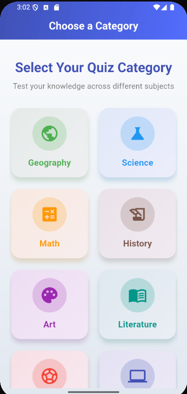
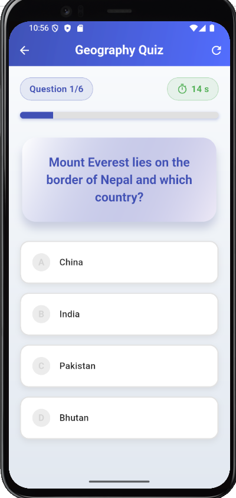
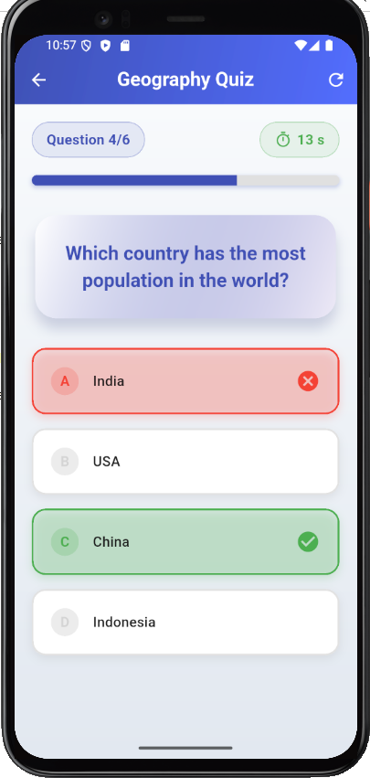
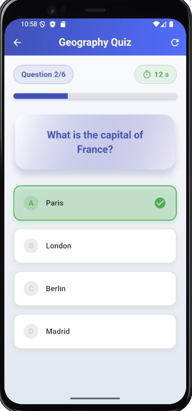
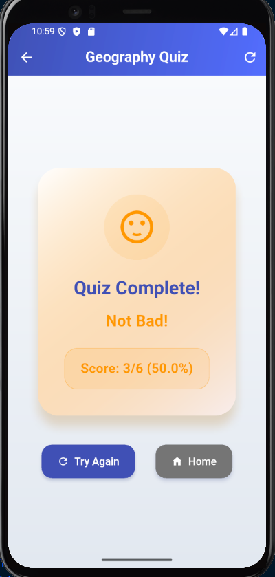
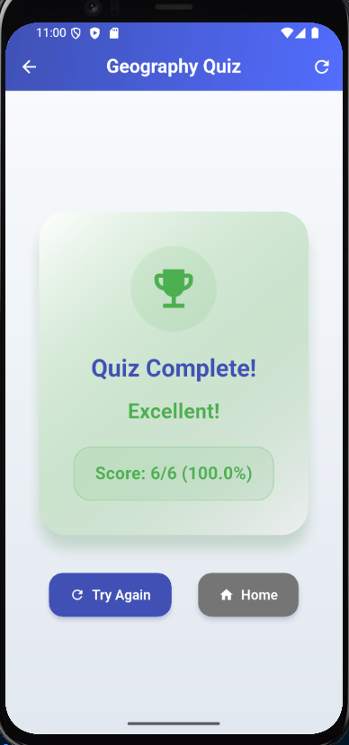

# 📚 Flutter Quiz App

A sleek, category-based multiple-choice Quiz App built entirely in a **single `main.dart` file** using Flutter. This app features animated transitions, a countdown timer, score tracking, and an elegant UI design — perfect for learning or as a starter Flutter project.

---

## 🚀 Features

- 🎯 Choose from 8 quiz categories:
  - Geography, Science, Math, History, Art, Literature, Sports, Technology
- 🔄 Randomized questions each session
- ⏳ 15-second countdown timer per question
- ✅ Instant feedback on correct/incorrect answers
- 📈 Final score summary with motivational feedback
- 🎨 Smooth UI animations and transitions
- 🧾 **All code in one file** (`main.dart`) for simplicity

---

## 🖼 Preview





---

## 🛠 Getting Started

### Prerequisites

- Flutter SDK installed ([Install Guide](https://flutter.dev/docs/get-started/install))
- Any IDE like VS Code, Android Studio, or IntelliJ
- An emulator or physical device

### Run the App

```bash
git clone https://github.com/ChornChhery/Quiz-App.git
cd Quiz-App
flutter pub get
flutter run

📁 File Structure
bash
Copy code
📂 quiz_app/
└── main.dart  # All app logic and UI in one file
📦 Dependencies
Only core Flutter & Dart libraries used:

material.dart

dart:math

dart:async

No third-party packages required.

✨ Customization
Want to expand this app?

Add more questions in _allQuestions

Add a scoring history or leaderboard

Fetch questions from a remote API or database

Use shared_preferences for persistent storage

- Widget Tree

📱 QuizApp (MaterialApp)

MaterialApp
└── ThemeData (custom)
└── Home: CategoryPage


🗂️ CategoryPage (Scaffold)
Scaffold
├── AppBar
│   └── Title: Text('Choose a Category')
├── Body: Container (Gradient Background)
│   └── Padding
│       └── Column
│           ├── SizedBox
│           ├── Text (Title)
│           ├── Text (Subtitle)
│           ├── SizedBox
│           └── Expanded
│               └── GridView.builder
│                   └── Category Card (repeated)
│                       └── Card
│                           └── InkWell
│                               └── Container
│                                   └── Column
│                                       ├── Icon in Circle
│                                       └── Text (Category)


❓ QuizPage (Scaffold)
Scaffold
├── AppBar
│   ├── Title: Text('${widget.selectedCategory} Quiz')
│   └── Refresh Button (IconButton)
├── Body: Container (Gradient)
│   └── Padding
│       └── Conditional
│           ├── If quizFinished → _buildResultView()
│           └── Else → Column
│               ├── Header (Row)
│               │   ├── InfoChip (Question #)
│               │   └── TimerChip (Time Left)
│               ├── SizedBox
│               ├── AnimatedBuilder (ProgressBar)
│               ├── SizedBox
│               ├── SlideTransition + FadeTransition
│               │   └── QuestionCard (Card)
│               ├── SizedBox
│               └── Expanded
│                   └── ListView.builder
│                       └── OptionCard (repeated)
│                           └── AnimatedContainer
│                               └── InkWell
│                                   └── Row
│                                       ├── Letter Circle (A/B/C...)
│                                       ├── Expanded: Text(option)
│                                       └── (Optional) Icon (✓ or ✗)


✅ _buildResultView()
Center
└── Column
    ├── Hero
    │   └── Card
    │       └── Container
    │           └── Column
    │               ├── Icon (Grade)
    │               ├── Text('Quiz Complete!')
    │               ├── Text(Grade Label)
    │               └── Score Box
    └── SizedBox
    └── Row
        ├── ElevatedButton (Try Again)
        └── ElevatedButton (Home)


🧑‍💻 Author
Made with ❤️ by Chhery Chorn

📄 License
This project is licensed under the Chhery Chorn.

Feel free to fork and modify it for your own quiz apps, but don't forget to give me a credit!


